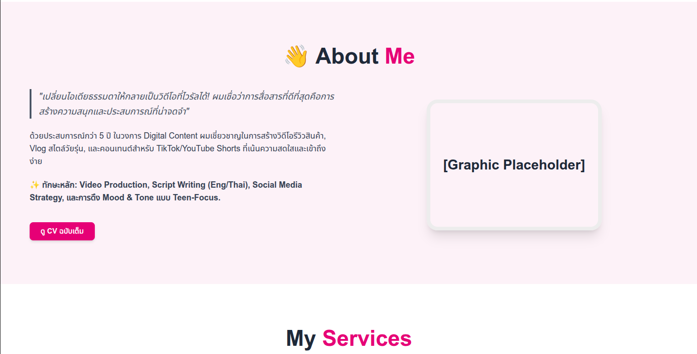
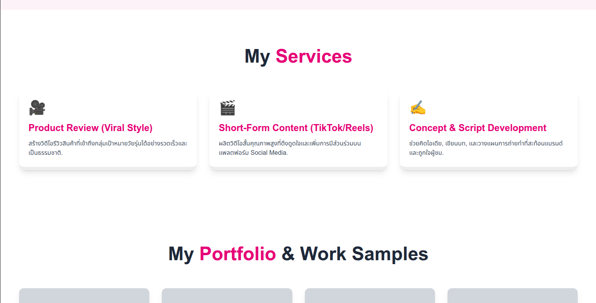

# ✨ Alex's VIBRANT Creator Portfolio ✨

**Portfolio หน้าเดียว (Single Page Application - SPA) ที่สร้างขึ้นสำหรับ Video Content Creator หรือ Influencer ที่เน้นความสดใส ทันสมัย และดึงดูดกลุ่มเป้าหมายวัยรุ่นโดยเฉพาะ**

## 🌟 ภาพรวมและแนวคิดของเว็บไซต์

  * **วัตถุประสงค์:** แสดงผลงานและบริการของ Content Creator (เน้นงานรีวิวและ Viral Content) ในรูปแบบที่น่าสนใจและเต็มไปด้วยพลังงาน
  * **อารมณ์ของเว็บ (Mood & Tone):** "Vibrant Teen Energy" - สดใส, ขี้เล่น, มีชีวิตชีวา, และเป็นกันเอง (Authentic)
  * **กลุ่มเป้าหมาย:** Brand Marketing Manager, เอเจนซี่, และลูกค้าที่มองหา Content Creator ที่เข้าใจตลาดวัยรุ่น

-----

## 🎨 ธีมสี (Color Palette)

เว็บไซต์นี้ใช้โทนสีหลักแบบ **High-Contrast, Pop Art-Inspired** เพื่อให้โดดเด่นและสอดคล้องกับธีมวัยรุ่นสดใส

| ตัวแปร Tailwind | รหัสสี (โดยประมาณ) | บทบาท | ตัวอย่างการใช้งาน |
| :--- | :--- | :--- | :--- |
| `blue-600` | `#38bdf8` (Sky 600) | **สีหลัก (Primary)** | พื้นหลังส่วน Hero, เส้นเน้น, ปุ่ม Hover |
| `pink-600` | `#ec4899` (Pink 600) | **สีเน้น (Accent)** | Call-to-Action (ปุ่ม), คำสำคัญในหัวข้อ, Border เน้น |
| `yellow-300` | `#fde047` (Yellow 300) | **สีรอง (Highlight)** | กรอบรูปภาพ, Text Highlight |
| ข้อความหลัก | `text-gray-800` | **ความคมชัด** | ข้อความเนื้อหาส่วนใหญ่ |

-----

## 💻 เทคโนโลยีที่ใช้ (Tech Stack)

| เทคโนโลยี | เวอร์ชัน | จุดเด่นที่ใช้ |
| :--- | :--- | :--- |
| **Frontend Framework** | Next.js 14+ | App Router, Server Components, ประสิทธิภาพสูง |
| **ภาษา** | TypeScript | เพิ่มความน่าเชื่อถือและความปลอดภัยของโค้ด |
| **Styling** | Tailwind CSS 4+ | Utility-first, Custom Color Palette, Responsive Design |
| **Animation** | Framer Motion | แอนิเมชันแบบ Scroll-based และ Component-based ที่ลื่นไหล |
| **Icons** | Font Awesome (SVG) | ใช้สำหรับ Social Media Icons |

-----

## 🏗️ โครงสร้าง Section หลัก

เว็บไซต์ประกอบด้วย 7 Sections หลักในรูปแบบ Single Page Application:

1.  **Header:** Navigation Bar แบบ Sticky พร้อมแอนิเมชัน Fade-in
2.  **Hero Section:** แนะนำตัว creator พร้อมวิดีโอ/รูปโปรไฟล์ขนาดใหญ่ และแอนิเมชัน Text Reveal
3.  **About Me:** ข้อมูลส่วนตัว, ทักษะหลัก, และ Passion ในการทำ Content
4.  **Services:** รายการบริการที่รับทำ (Product Review, Short-Form, Scripting) ในรูปแบบ Card Layout
5.  **Portfolio / Work Samples:** แสดงผลงานที่โดดเด่นด้วย Grid Layout พร้อม Hover Effect
6.  **Testimonials:** คำรับรองจากลูกค้าเพื่อเพิ่มความน่าเชื่อถือ
7.  **Contact:** แบบฟอร์มติดต่อและลิงก์ Social Media Icons

-----

## 🚀 ขั้นตอนการนำไปใช้ (Installation & Usage)

### 1\. ติดตั้ง Dependencies

ตรวจสอบให้แน่ใจว่าคุณติดตั้ง Packages ทั้งหมด รวมถึง **Framer Motion** และ **Font Awesome** แล้ว:

```bash
# ติดตั้ง Framer Motion
npm install framer-motion

# ติดตั้ง Font Awesome Components และ Icons (Brands)
npm install --save @fortawesome/react-fontawesome @fortawesome/free-brands-svg-icons @fortawesome/free-solid-svg-icons
```

### 2\. รัน Development Server

รันโปรเจกต์ Next.js ในโหมดพัฒนา:

```bash
npm run dev
# หรือ
yarn dev
```

เว็บไซต์จะเปิดขึ้นที่ `http://localhost:3000`

### 3\. การ Deploy

โปรเจกต์ Next.js นี้ถูกออกแบบมาให้ Deploy บน **Vercel** ได้อย่างราบรื่น (แนะนำ):

1.  Push โค้ดไปยัง Repository (GitHub, GitLab, หรือ Bitbucket)
2.  เชื่อมต่อ Vercel Account กับ Repository
3.  Vercel จะตรวจพบว่าเป็นโปรเจกต์ Next.js และทำการ Deploy โดยอัตโนมัติ

-----

## ⚙️ การปรับแต่ง (Customization)

### 1\. การเปลี่ยนสีหลัก

หากต้องการเปลี่ยนโทนสี ให้แก้ไขที่ไฟล์ **`tailwind.config.ts`** โดยปรับค่า Hex Code หรือ Utility Class ของ Tailwind:

```typescript
// tailwind.config.ts
// ...
  theme: {
    extend: {
      colors: {
        'primary-blue': '#xxxxxx', // เปลี่ยนสีหลัก
        'accent-pink': '#yyyyyy', // เปลี่ยนสีเน้น (CTA)
        'highlight-yellow': '#zzzzzz', // เปลี่ยนสีรอง
      },
    },
  },
// ...
```

### 2\. การปรับข้อมูล (Content)

  * **Header:** แก้ไขรายการนำทางใน `components/Header.tsx`
  * **Hero Section:** แทนที่ Placeholder วิดีโอ/รูปโปรไฟล์ใน `components/HeroSection.tsx`
  * **Services/Portfolio/Testimonials:** ข้อมูลทั้งหมดถูก Hardcode ในไฟล์ Component นั้นๆ (เช่น `servicesData` ใน `components/Services.tsx`) ควรปรับปรุงให้ใช้ **External Data Source** หรือ **CMS** ในอนาคตเพื่อความสะดวกในการจัดการข้อมูล

### 3\. การปรับแต่งแอนิเมชัน

แอนิเมชันทั้งหมดถูกควบคุมโดย **Framer Motion** ใน Component ต่างๆ:

  * **`initial` / `animate`:** ควบคุมสถานะเริ่มต้นและการเปลี่ยนผ่าน
  * **`whileInView`:** ควบคุมแอนิเมชันเมื่อ Section เข้าสู่หน้าจอ (Viewport)
  * **`transition`:** ปรับความเร็ว (`duration`), ชนิด (`type: 'spring'`), และความดีดตัว (`stiffness`, `damping`)

> **ตัวอย่าง:** หากต้องการให้แอนิเมชันเร็วขึ้นใน `AboutMe.tsx`, ให้ลดค่า `stiffness` หรือเพิ่ม `damping` ใน `itemVariants`:
>
> ```typescript
> // components/AboutMe.tsx
> transition: { type: 'spring', stiffness: 80, damping: 10 }, // ค่าที่ปรับให้เร็วขึ้น
> ```

-----







